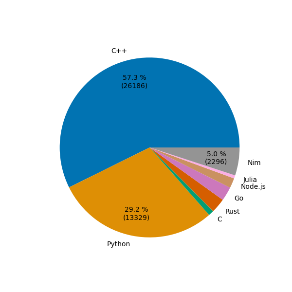

# Advent of Code
Advent of Code in many languages for exercise.

**ATTENTION**:  

1) The language proportions indicated by GitHub are NEVER indicative of the ratio of characters needed to solve the challenges, since it counts also utilities (e.g. the Python counter I use for the plots), and headers/libraries of C/C++.
2) The language proportions indicated by the plot below most of the time are NOT indicative of characters needed to solve the challenges, since I first solve the challenges in the languages I am most confident or which I need to improve in that moment.
3) The plot in this page and the plots in every subfolder count the charaters needed for each program, excluding the above mentioned utilities and libraries.

**HOWEVER**:  
1) If you are curious of the proportion of code written in different programming languages to solve the same problem, you can take a look at the plot inside each folder! :)
2) I try to use the same logic in different programming languages when it is possible to do it while still remaining idiomatic, which is the majority of the case but not all of them!

