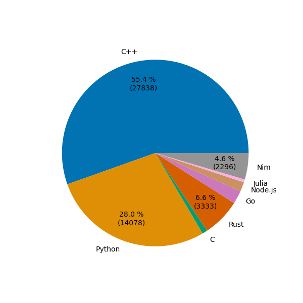

# Advent of Code
Advent of Code in many languages for exercise.

**ATTENTION**: most of the time, the proportion of the languages indicated by GitHub are NOT indicative of the ratio of characters needed to solve the challenges. This is due to the fact that usually I use the languages I am most confident in and I may solve some problems only in a subset of the languages used in the repository.

If you are curious of the proportion of code written in different programming languages to solve the same problem, take a look at the plot inside each folder! :)

